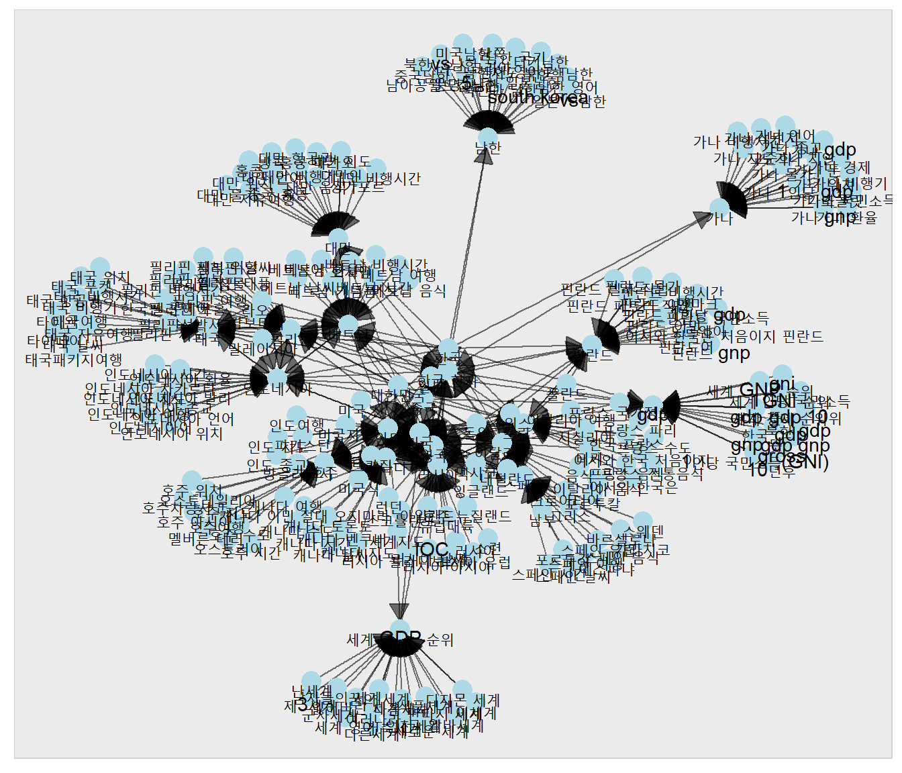

```{r env, echo = F, warning = F, message = F}
pacman::p_load(knitr, tidyverse, readr, magrittr, igraph); library(rdevteam)
opts_chunk$set(fig.path = "image/figure/", fig.align = "center", out.width = "80%", warning = F, message = F)
```

<br><br>

## Install

```{r eval = F}
devtools::install_github("lovetoken/rdevteam")
library(rdevteam)
```

<br><br>

## 주요기능

### 네이버 연관검색어 추출 : `naverRelation1()`, `naverRelation2()`

```{r}
naverRelation1("한국")
naverRelation2("한국")
```

### 네트워크 시각화 : `networkPlot()`

```{r eval = F}
library(dplyr)
library(igraph)

network_graph <- naverRelation2("한국") %>%
  count(R2, R1) %>%
  graph_from_data_frame
  
networkPlot(network_graph)
```



<br><br>

## License

[GPL-3](https://www.gnu.org/licenses/gpl-3.0.en.html)
