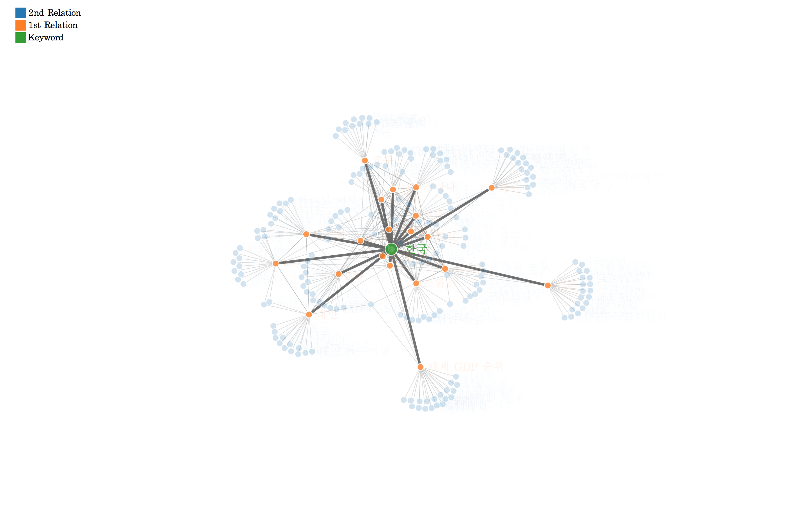

```{r env, echo = F, warning = F, message = F}
pacman::p_load(knitr, tidyverse, readr, magrittr, igraph); library(rdevteam)
opts_chunk$set(fig.path = "image/figure/", fig.align = "center", out.width = "80%", warning = F, message = F)
```

## R dev team on Korea

R dev team 은 R을 이용한 분석에 관심을 가진 사람들이 모여있는 커뮤니티 입니다.  
R을 이용한 통계분석, 워크플로우 개선, 분석 어플리케이션 개발등의 역량을 올리기 위하여 자발적으로 오픈세미나를 열고 있습니다.  
다양한 과제들을 자체적으로 만들고 풀어나가고 있으며 그 과정중 의미있는 성과가 있을때 그 성과를 쉽게 활용하기 위하여 `rdevteam` package 를 공유, 배포, 관리하고 있습니다.

* [R dev team 오픈채팅방](https://open.kakao.com/o/gEdB6wo) 
* [R dev team open seminar archive](https://lovetoken.gitbooks.io/r-dev-team-open-seminar/content/)

<br><br>

## 설치방법

R sesseion 에서 아래의 코드를 실행합니다.  

```{r eval = F}
devtools::install_github("lovetoken/rdevteam")
```

그리고 아래 코드로 로드하여 기능들을 사용 할 수 있습니다.

```{r eval = F}
library(rdevteam)
```

사용가능한 주요 기능들은 아래에 설명합니다.

<br><br>

## 주요기능

### 크롤링

#### 네이버 연관검색어 추출 : `naverRelation()`

검색포털사이트 [네이버](https://www.naver.com/)의 연관검색어 정보를 테이블 형태로 반환합니다.  

```{r eval = T}
ex1 <- naverRelation("한국", 1)
ex2 <- naverRelation("한국", 2)

ex1
ex2
```

네트워크 시각화가 필요할 경우 `plot()` 함수의 호환을 제공합니다.

```{r eval = F}
plot(ex2)
```



#### 네이버 급상승 검색어 추출 : `naverRank()`

[네이버 Data Lab](https://datalab.naver.com/keyword/realtimeList.naver) 에서 제공하는 서비스를 기반으로 급상승 검색어를 추출합니다.

```{r eval = T}
naverRank()
```

<br><br>

## License

[GPL-3](https://www.gnu.org/licenses/gpl-3.0.en.html)
